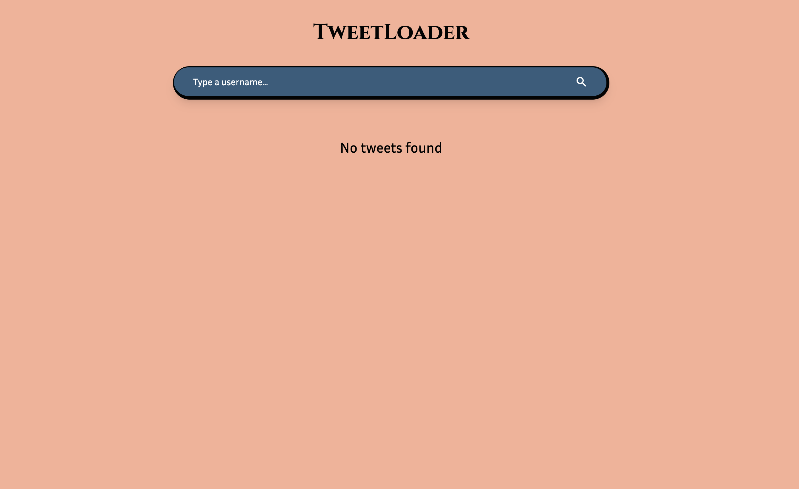
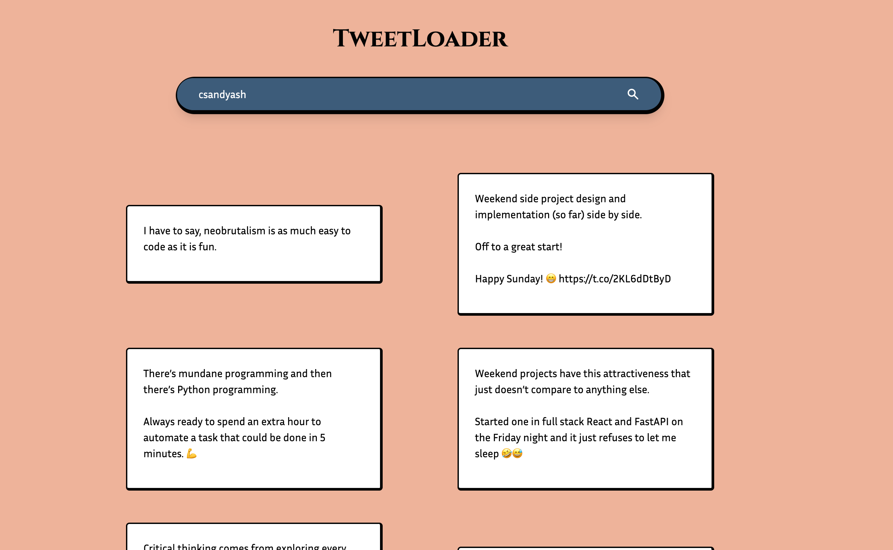
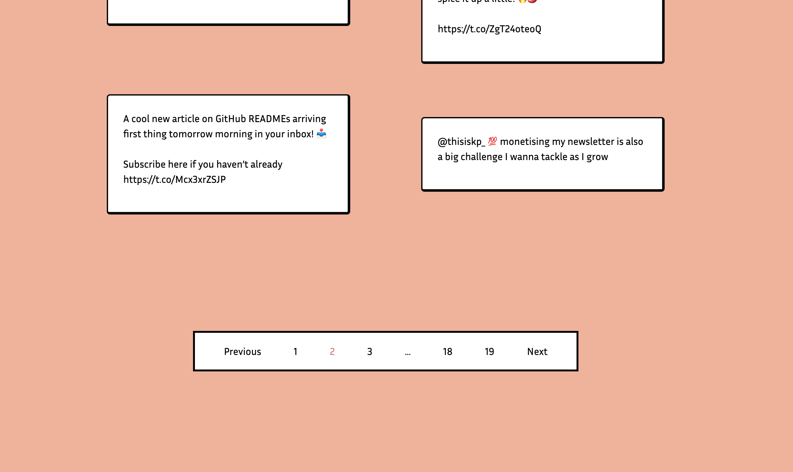

# TweetLoader

A webapp to load maximum possible past tweets from any given username using the Twitter API.

## Stack

- backend: in the `backend/` folder.

  - FastAPI, Tweepy, Uvicorn

- Frontend: in the `client/` folder.
  - React, Tailwind CSS

## Running the app

1. Clone via git:

```
$ git clone git@github.com:yashprakash13/tweet-loader.git
```

2. Open two tabs, one for the client, one for the backend:

   2.1

   ```
   $ npm install
   $ npm run start
   ```

   2.2

   ```
   $ poetry install
   $ poetry run uvicorn main:app --reload
   ```

3. Type in a username in the search bar and get their tweets!

## Screenshots / Design of the app







### [Follow me on Twitter](https://twitter.com/csandyash) 😉
